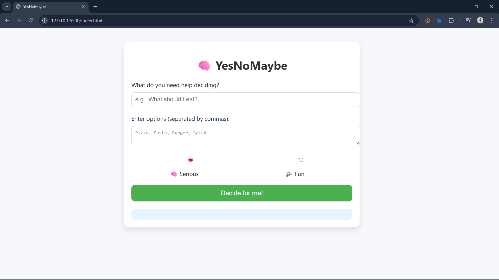

# 💡 YesNoMaybe  

A simple and fun web app that gives you random **Yes**, **No**, or **Maybe** answers. Perfect for quick decisions or just for fun.  

## ✨ Features  
- Clean and minimal design  
- Randomized answers each time you click  
- Works instantly in the browser—no setup needed

## 📸 Screenshot

Here's a preview of the app in action:



## 🌐 Live Demo  
You can try it out here:  
👉 [Live Demo](https://tech-savvy1.github.io/YesNoMaybe/)

## 🛠️ Tech Stack  
- HTML5 
- CSS3 
- JavaScript

## 🚀 How to Use  
1. Open the project folder.  
2. Double-click `index.html` to launch it in your browser.  
3. Click the button and get your answer!  

## 📂 Project Structure  
- `index.html` – main webpage  
- `style.css` – styling for the app  
- `script.js` – handles the random Yes/No/Maybe logic

## 📜 License  
This project is open for anyone to use, modify, and share.  

## 🔧 Clone and Run Locally
```bash
git clone https://github.com/tech-savvy1/YesNoMaybe.git
